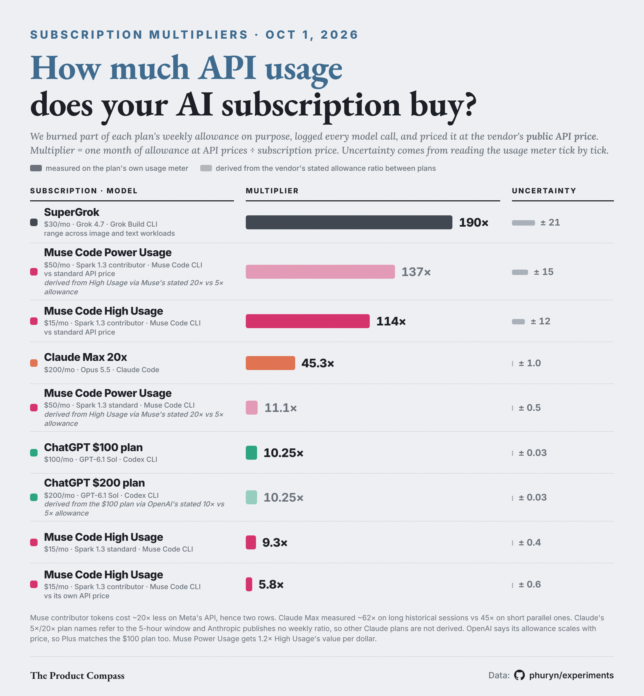

# subscription-multipliers

How much API usage does an AI coding subscription actually buy? For each plan we burned a slice of the weekly allowance on purpose, logged every model call, and priced those calls at the vendor's **public API list price**. The multiplier is what a full month of the allowance would cost on the API, divided by the subscription price.

| Subscription · model | Price / month | Multiplier | Uncertainty |
|---|---|---|---|
| [SuperGrok · Grok 4.7 · Grok Build CLI — range across image and text workloads](01-supergrok/) | $30 | **190×** | ± 21 |
| [Muse Code Power Usage · Spark 1.3 contributor · Muse Code CLI — vs standard API price, *derived, not measured*](04-muse-code/#other-muse-code-plans-derived) | $50 | *137×* | ± 15 |
| [Muse Code High Usage · Spark 1.3 contributor · Muse Code CLI — vs standard API price](04-muse-code/) | $15 | **114×** | ± 12 |
| [Claude Max 20x · Opus 5.5 · Claude Code](02-claude-max/) | $200 | **45.3×** | ± 1.0 |
| [Muse Code Power Usage · Spark 1.3 standard · Muse Code CLI — *derived, not measured*](04-muse-code/#other-muse-code-plans-derived) | $50 | *11.1×* | ± 0.5 |
| [ChatGPT $100 plan · GPT-6.1 Sol · Codex CLI](03-codex/) | $100 | **10.25×** | ± 0.03 |
| [ChatGPT $200 plan · GPT-6.1 Sol · Codex CLI — *derived, not measured*](03-codex/#other-chatgpt-plans-derived) | $200 | *10.25×* | ± 0.03 |
| [Muse Code High Usage · Spark 1.3 standard · Muse Code CLI](04-muse-code/) | $15 | **9.3×** | ± 0.4 |
| [Muse Code High Usage · Spark 1.3 contributor · Muse Code CLI — vs its own API price](04-muse-code/) | $15 | **5.8×** | ± 0.6 |

Measured Oct 1, 2026, each plan on its own, with other usage of that plan paused.

**Other Claude plans are not derived.** Anthropic defines Max 5x and Max 20x as 5× and 20× Pro's *per-session* (5-hour) allowance and publishes no ratio for the weekly limit this set measures; third-party reports put the Max 20x / Max 5x weekly ratio around 1.5–2×, not 4×. OpenAI says its Codex allowance scales with price (Plus 1×, Pro $100 5×, Pro $200 10×), so every ChatGPT tier comes out at the measured 10.25×. **Muse Code Power Usage is derived the same way:** Muse describes Everyday Usage ($5) as the base allowance, High Usage ($15) as 5× and Power Usage ($50) as 20×, so Power gets 4× High Usage's allowance for 3.33× the price: High Usage × 1.2 (11.1× standard, 137× contributor vs standard API price, 7.0× contributor vs its own API price).

**Uncertainty** is the bracket on the run's average, explained below; for SuperGrok it is the range between its image and text workloads, which differ more than the meter-reading bracket. Individual percent points can vary more than that (Codex's ranged 9.7–10.7×); every point is listed in each folder.

**Contributor has two discounts that pull in opposite directions.** A Muse Code percent buys ~12× more contributor tokens than standard tokens, and Meta's API also sells contributor tokens ~20× cheaper ($0.10 / $0.002 / $0.20 per million vs $1.25 / $0.15 / $4.25). Against the private-data API price the plan is worth 114×; against contributor's own API price, 5.8×. Details in [04-muse-code](04-muse-code/).

## Experiments

| # | Plan | What was run | Headline |
|---|---|---|---|
| [01](01-supergrok/) | SuperGrok ($30) | Grok Build CLI, Grok 4.7 at xhigh, 5 parallel sessions: images, then never-seen random text; weekly meter read every ~30 s | **190× ± 21** — image work ≈170×, cache-heavy text work ≈200×; a percent of the week is worth $11–15 of API usage |
| [02](02-claude-max/) | Claude Max 20x ($200) | Claude Code `-p`, Opus 5.5, 6 parallel read-only sessions | **45.3× ± 1.0**; long historical sessions (Sep 28–30) came out at ~62× — not in the table because the meter may have changed since |
| [03](03-codex/) | ChatGPT $100 plan | Codex CLI, GPT-6.1 Sol at high, 6 parallel read-only sessions | **10.25× ± 0.03**; single points 9.7–10.7× |
| [04](04-muse-code/) | Muse Code High Usage ($15) | Muse Code, Spark 1.3 standard and contributor, up to 8 parallel sessions | standard **9.3× ± 0.4**; contributor **5.8×** vs its own API price, **114×** vs standard's |

## Shared method

1. **Meter.** Each vendor exposes the weekly allowance as a percentage. We read it from the vendor's own client with a timestamp: Claude Code's `rate_limit_event` (`seven_day.utilization`), Codex's `rate_limits.primary.used_percent` in its session log, Grok's `_x.ai/billing` → `creditUsagePercent`, Muse's MSP `usage/read` → `weekly.usedPercent`. All are whole percentages.
2. **Spend.** Every model call made on that plan during the run, from the client's own logs, priced at the vendor's public API list price for the model that served it (tables in each folder). Calls from any other session of the same plan on the same machine are included.
3. **Only full steps count.** A run starts somewhere inside a percent (at 7.4%, say), so the stretch before the first tick and after the last tick is dropped. Between two ticks lies exactly one point.
4. **Floor and ceiling per step.** A tick happened between the last reading at the old value and the first reading at the new one. For the step between tick k and tick k+1:
   - floor = spend from the first reading after tick k to the last reading before tick k+1 (certainly inside the step),
   - ceiling = spend from the last reading before tick k to the first reading after tick k+1 (certainly covers it).
   The same is computed once for the whole run (first tick to last tick).
5. **Uncertainty = the whole-run bracket.** The run's average value per point lies between the whole-run floor and ceiling; the table shows the midpoint and half that width. This holds whether or not individual points cost the same, so it is used for every row. As a consistency check, each folder also reports the per-step brackets and their max floor … min ceiling: where those intersect, every point is consistent with one constant value (Grok, Claude, Muse standard); where they don't, points genuinely differ (Codex narrowly, Muse contributor clearly).
6. **Multiplier** = $ per point × 100 × (30.4375 / 7 weeks per month) ÷ monthly price.

Readings from parallel sessions can arrive out of order; a reading lower than one already seen is a stale observation and is dropped. Everything above is [`analyze.py`](analyze.py) — run `python analyze.py <experiment>/results <price>` on any folder to reproduce its numbers. [`extract_logs.py`](extract_logs.py) is how the CSVs were cut from each client's local logs.

## Caveats that apply to the whole set

- **A multiplier assumes you can use the whole week.** Claude and Muse also have a 5-hour window. On Muse standard it binds hard: a full 5-hour window was worth only ~$10 of API usage.
- **Workload moves the number.** Vendors don't meter exactly in API dollars. On Claude, the same plan measured 45× on short parallel sessions (60% of API cost was 5-minute cache writes) and ~62× on long historical sessions from Sep 28–30 (78% cache reads). The historical figure is not in the table because it predates the dedicated runs and the meter may have changed since. Read each multiplier as "for this kind of work".
- **Usage off the machine is invisible.** Claude's and Grok's meters are shared with their web apps and other devices; those were paused for the runs, but a stray use would make a plan look *less* generous, never more.
- **One run per plan, a few points each** (2–6 full steps). The brackets say how tight each measurement is; they don't say the vendor won't change its meter next week.
- **List price is what an API user would pay**, so internal per-call cost fields some clients print (Grok's is one third of list) are not used.
